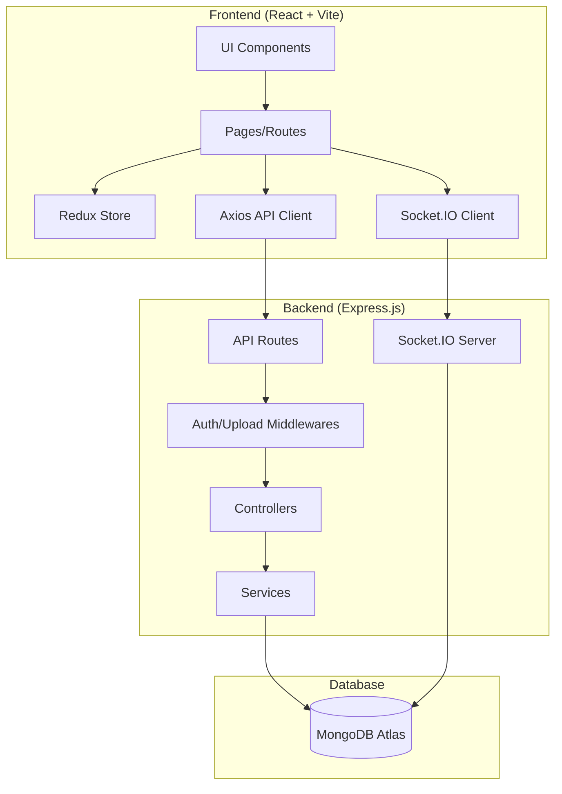

# EduNexus RMS - Project Structure

## 📁 Complete Project Overview

```
RMS Project/
├── 📂 backend/                    # Express.js API Server
├── 📂 frontend/                   # React + Vite Client
├── 📂 docs/                       # Documentation
└── 📄 README.md
```

---

## 🔧 Backend Structure

```
backend/
├── 📄 package.json                # Dependencies & scripts
├── 📄 vercel.json                 # Vercel deployment config
├── 📄 .env                        # Environment variables
│
└── 📂 src/
    ├── 📄 app.js                  # Express app setup, routes, middlewares
    ├── 📄 server.js               # HTTP server + Socket.IO initialization
    │
    ├── 📂 config/
    │   └── 📄 database.js         # MongoDB connection
    │
    ├── 📂 middlewares/
    │   ├── 📄 authMiddleware.js   # JWT authentication
    │   ├── 📄 roleMiddleware.js   # Role-based access control
    │   └── 📄 upload.js           # Multer file upload (avatars, tasks, materials)
    │
    ├── 📂 utils/
    │   ├── 📄 jwt.js              # Token generation/verification
    │   ├── 📄 email.js            # Email sending (nodemailer)
    │   └── 📄 password.js         # Password hashing (bcrypt)
    │
    ├── 📂 socket/
    │   ├── 📄 index.js            # Socket.IO main setup
    │   ├── 📄 chat.socket.js      # General chat events
    │   ├── 📄 reviewChat.socket.js # Review session chat
    │   └── 📄 notification.socket.js # Real-time notifications
    │
    └── 📂 modules/                # Feature-based modules
        │
        ├── 📂 admin/              # Admin management
        │   ├── 📄 adminController.js
        │   ├── 📄 adminRoutes.js
        │   └── 📄 Admin.js (model)
        │
        ├── 📂 auth/               # Authentication
        │   ├── 📄 authController.js
        │   ├── 📄 authRoutes.js
        │   └── 📄 User.js (model)
        │
        ├── 📂 users/              # User CRUD
        │   ├── 📄 userController.js
        │   ├── 📄 userRoutes.js
        │   └── 📄 User.js (model)
        │
        ├── 📂 students/           # Student profiles
        │   ├── 📄 studentProfileController.js
        │   ├── 📄 studentRoutes.js
        │   └── 📄 Student.js (model)
        │
        ├── 📂 advisor/            # Advisor features
        │   ├── 📄 advisorController.js
        │   ├── 📄 advisorRoutes.js
        │   └── 📄 Advisor.js (model)
        │
        ├── 📂 reviewer/           # Reviewer features
        │   └── 📄 Reviewer.js (model)
        │
        ├── 📂 reviewerAvailability/ # Reviewer scheduling
        │   ├── 📄 availabilityController.js
        │   ├── 📄 availabilityRoutes.js
        │   └── 📄 Availability.js (model)
        │
        ├── 📂 reviews/            # Review sessions (CORE)
        │   ├── 📄 reviewController.js    # Main controller
        │   ├── 📄 reviewRoutes.js
        │   ├── 📄 review.service.js      # Business logic
        │   ├── 📄 review.validation.js   # Input validation
        │   ├── 📄 review.helpers.js      # Pure utility functions
        │   ├── 📄 reviewSession.js       # ReviewSession model
        │   ├── 📄 ReviewerEvaluation.js  # Evaluation model
        │   └── 📄 FinalEvaluation.js     # Final score model
        │
        ├── 📂 tasks/              # Student tasks
        │   ├── 📄 taskController.js
        │   ├── 📄 taskRoutes.js
        │   └── 📄 Task.js (model)
        │
        ├── 📂 materials/          # Study materials
        │   ├── 📄 materialsController.js
        │   ├── 📄 materialsRoutes.js
        │   └── 📄 Material.js (model)
        │
        ├── 📂 notifications/      # Push notifications
        │   ├── 📄 notificationController.js
        │   ├── 📄 notificationRoutes.js
        │   └── 📄 Notification.js (model)
        │
        ├── 📂 chat/               # Messaging
        │   ├── 📄 chatController.js
        │   ├── 📄 chatRoutes.js
        │   └── 📄 Chat.js (model)
        │
        └── 📂 issues/             # Issue tracking
            ├── 📄 issueController.js
            ├── 📄 issueRoutes.js
            └── 📄 Issue.js (model)
```

---

## ⚛️ Frontend Structure

```
frontend/
├── 📄 package.json                # Dependencies
├── 📄 vite.config.js              # Vite configuration
├── 📄 index.html                  # Entry HTML
│
└── 📂 src/
    ├── 📄 main.jsx                # React entry point
    ├── 📄 App.jsx                 # Root component + routing
    ├── 📄 index.css               # Global styles
    │
    ├── 📂 api/
    │   └── 📄 axios.js            # Axios instance with interceptors
    │
    ├── 📂 socket/
    │   ├── 📄 socket.js           # Socket.IO client setup
    │   └── 📄 socketContext.js    # React context for socket
    │
    ├── 📂 constants/
    │   └── 📄 index.js            # App-wide constants
    │
    ├── 📂 utils/
    │   ├── 📄 helpers.js          # Utility functions
    │   └── 📄 validators.js       # Form validation
    │
    ├── 📂 assets/
    │   └── 📂 images/             # Static images
    │
    ├── 📂 components/             # Reusable UI components
    │   ├── 📄 Layout.jsx          # Main app layout with sidebar
    │   ├── 📄 ProtectedRoute.jsx  # Auth route wrapper
    │   ├── 📄 Avatar.jsx          # User avatar component
    │   ├── 📄 Loader.jsx          # Loading spinner
    │   ├── 📄 Button.jsx          # Custom button
    │   ├── 📄 ScoreSlider.jsx     # Score input slider
    │   │
    │   ├── 📂 common/             # Shared components
    │   │   └── 📄 ...
    │   │
    │   ├── 📂 profile/            # Profile components
    │   │   └── 📄 ...
    │   │
    │   └── 📂 modals/             # Modal dialogs
    │       ├── 📄 AssignReviewModal.jsx
    │       ├── 📄 CancelReviewModal.jsx
    │       ├── 📄 ChangePasswordModal.jsx
    │       ├── 📄 CreateUserModal.jsx
    │       ├── 📄 FinalScoringModal.jsx
    │       ├── 📄 ForgotPasswordModal.jsx
    │       ├── 📄 RescheduleReviewModal.jsx
    │       ├── 📄 ReviewerEvaluationModal.jsx
    │       ├── 📄 StudentProfileModal.jsx
    │       └── 📄 ViewReviewModal.jsx
    │
    ├── 📂 features/               # Redux slices (state management)
    │   ├── 📂 auth/               # Auth state
    │   ├── 📂 admin/              # Admin state
    │   ├── 📂 advisor/            # Advisor state
    │   ├── 📂 reviewer/           # Reviewer state
    │   ├── 📂 student/            # Student state
    │   └── 📂 availability/       # Availability state
    │
    └── 📂 pages/                  # Route pages
        ├── 📄 Login.jsx           # Login page
        ├── 📄 ResetPassword.jsx   # Password reset
        │
        ├── 📂 dashboards/         # Role-specific dashboards
        │   ├── 📄 AdminDashboard.jsx
        │   ├── 📄 AdvisorDashboard.jsx
        │   ├── 📄 ReviewerDashboard.jsx
        │   └── 📄 StudentDashboard.jsx
        │
        ├── 📂 admin/              # Admin pages
        │   ├── 📄 ManageUsers.jsx
        │   ├── 📄 Reports.jsx
        │   └── 📄 ...
        │
        ├── 📂 advisor/            # Advisor pages
        │   ├── 📄 Students.jsx
        │   ├── 📄 Reviews.jsx
        │   ├── 📄 ReviewerAvailability.jsx
        │   ├── 📄 Calendar.jsx
        │   └── 📄 ...
        │
        ├── 📂 reviewer/           # Reviewer pages
        │   ├── 📄 MyReviews.jsx
        │   ├── 📄 Availability.jsx
        │   └── 📄 ...
        │
        ├── 📂 student/            # Student pages
        │   ├── 📄 MyReviews.jsx
        │   ├── 📄 Tasks.jsx
        │   ├── 📄 Progress.jsx
        │   ├── 📄 Materials.jsx
        │   └── 📄 ...
        │
        └── 📂 shared/             # Shared pages
            └── 📄 ...
```

---

## 🔄 Architecture Diagram



---

## 🎯 Key Module Relationships

```
┌─────────────────────────────────────────────────────────────┐
│                        USER ROLES                           │
├───────────┬───────────┬───────────┬─────────────────────────┤
│   Admin   │  Advisor  │ Reviewer  │        Student          │
├───────────┴───────────┴───────────┴─────────────────────────┤
│                                                             │
│  Admin:     Manages users, views reports, system settings   │
│  Advisor:   Creates reviews, assigns reviewers, monitors    │
│  Reviewer:  Conducts reviews, submits evaluations           │
│  Student:   Attends reviews, views feedback, manages tasks  │
│                                                             │
└─────────────────────────────────────────────────────────────┘

┌─────────────────────────────────────────────────────────────┐
│                    CORE DATA FLOW                           │
├─────────────────────────────────────────────────────────────┤
│                                                             │
│  1. Advisor creates ReviewSession                           │
│          ↓                                                  │
│  2. System checks Reviewer Availability                     │
│          ↓                                                  │
│  3. Reviewer assigned → Notification sent                   │
│          ↓                                                  │
│  4. Review conducted → ReviewerEvaluation submitted         │
│          ↓                                                  │
│  5. Advisor adds FinalEvaluation                            │
│          ↓                                                  │
│  6. Student views feedback in Progress page                 │
│                                                             │
└─────────────────────────────────────────────────────────────┘
```

---

## 📊 API Routes Summary

| Prefix | Module | Description |
|--------|--------|-------------|
| `/api/auth` | auth | Login, logout, password reset |
| `/api/admin` | admin | User management, reports |
| `/api/users` | users | User CRUD operations |
| `/api/students` | students | Student profiles |
| `/api/advisor` | advisor | Advisor-specific APIs |
| `/api/reviewer/availability` | reviewerAvailability | Scheduling |
| `/api/reviews` | reviews | Review session CRUD |
| `/api/tasks` | tasks | Student tasks |
| `/api/materials` | materials | Study materials |
| `/api/notifications` | notifications | Push notifications |
| `/api/chat` | chat | Messaging |
| `/api/issues` | issues | Issue tracking |
